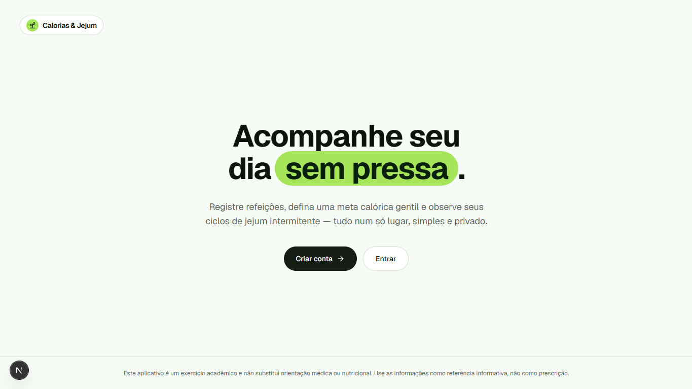
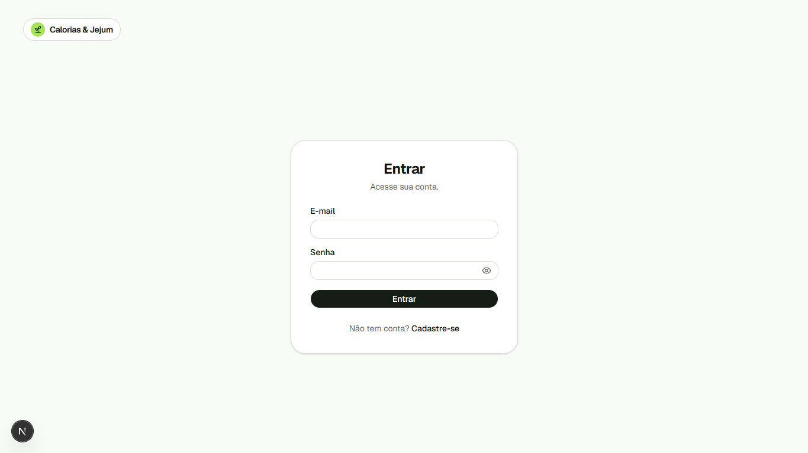
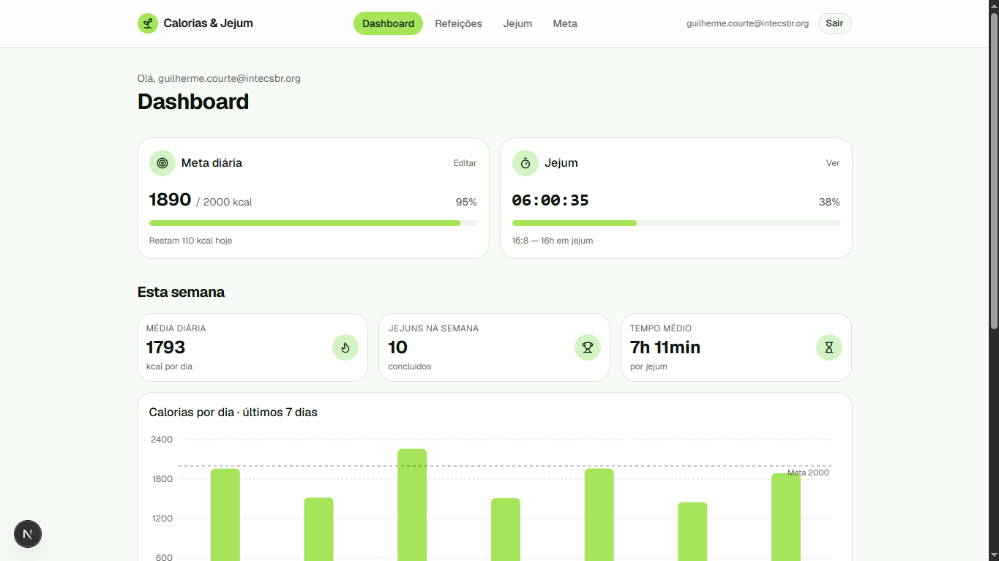
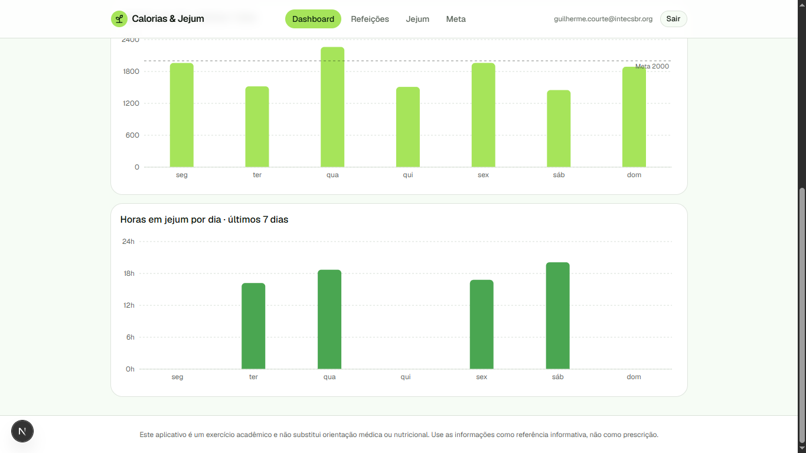
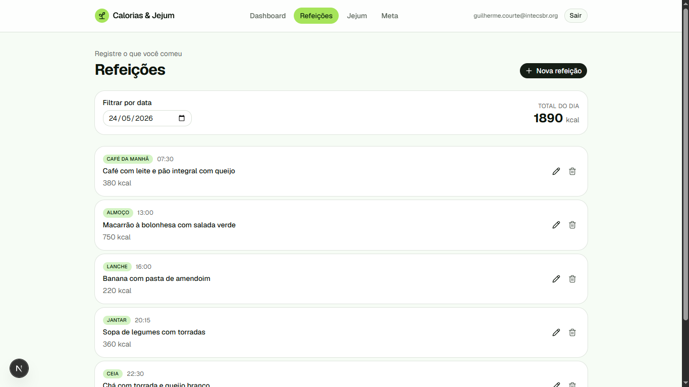
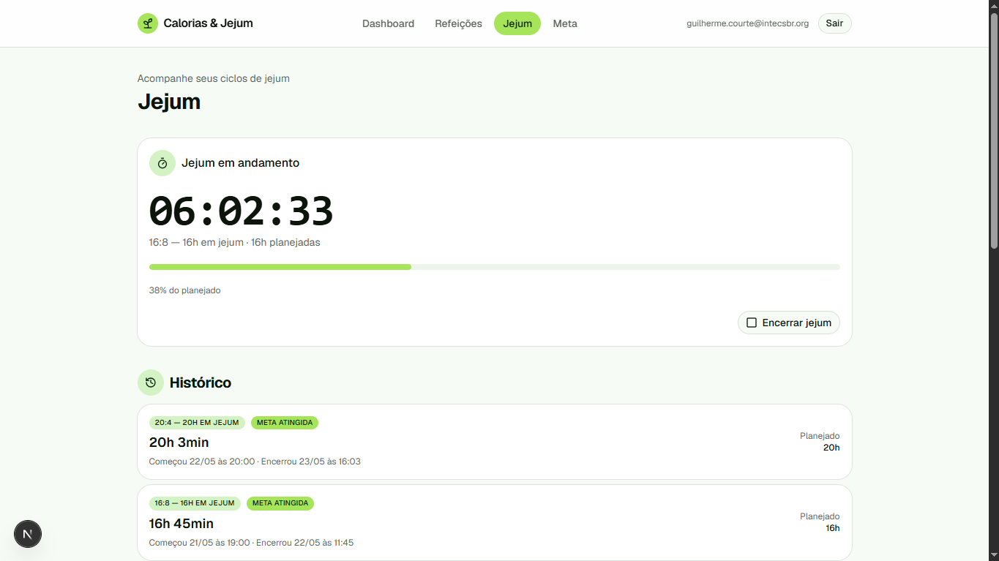
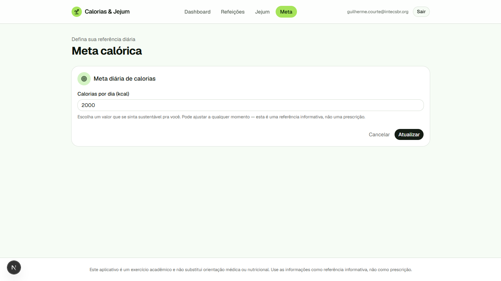

# Calorias & Jejum

Aplicação web para acompanhamento de **consumo calórico** e **jejum intermitente**.
Trabalho final da disciplina — Senac 2026/1 TSI DSW.

> ⚠️ **Aviso ético**: este aplicativo é um exercício acadêmico e **não substitui
> orientação médica ou nutricional**. As informações são apenas referência informativa,
> nunca prescrição. Procure profissional habilitado antes de adotar metas calóricas
> agressivas ou ciclos longos de jejum.

🔗 **Aplicação em produção**: <https://caloriasjejum.vercel.app>
🎥 **Vídeo demo**: <https://youtu.be/9t5okXqC4FE>

---

## Funcionalidades

- **Autenticação** com e-mail e senha (Firebase Auth)
- **CRUD de refeições** com filtro por data, descrição, tipo (café, almoço, lanche, jantar, ceia) e calorias
- **Meta calórica diária** ajustável a qualquer momento
- **Ciclos de jejum** com timer ao vivo (`HH:MM:SS`), tipos pré-definidos (16:8, 18:6, 20:4, 24h) ou personalizado (1–72h), apenas um ativo por vez
- **Histórico de jejuns** concluídos, embutido na página de jejum
- **Dashboard** com:
  - Card de meta diária (consumido vs. meta, barra de progresso)
  - Card de jejum atual (timer + % do planejado)
  - KPIs da semana (média kcal/dia, jejuns concluídos, tempo médio)
  - Gráfico de calorias por dia (últimos 7 dias) com linha de referência da meta
  - Gráfico de horas em jejum por dia (últimos 7 dias)
- **Rotas protegidas** — sem login, acesso ao app é redirecionado para `/login`
- **Regras Firestore** garantindo que cada usuário só acessa os próprios dados
- **Aviso ético** no rodapé de todas as páginas autenticadas
- **Responsivo** (mobile e desktop), **acessibilidade básica** (labels, `aria-*`, skip-to-content, navegação por teclado)

## Stack

| Camada | Tecnologia |
| --- | --- |
| Framework | **Next.js 15** (App Router) + **TypeScript** |
| Auth | **Firebase Authentication** (e-mail/senha) |
| Banco de dados | **Cloud Firestore** |
| UI | **Tailwind CSS v4** + **shadcn/ui** (base-ui) |
| Forms / validação | **react-hook-form** + **Zod** |
| Gráficos | **Recharts** |
| Notificações | **sonner** |
| Ícones | **lucide-react** |
| Deploy | **Vercel** |

## Setup local

Pré-requisitos: **Node.js 22+** e uma conta no **Firebase**.

```bash
npm install
cp .env.example .env.local   # preencha as chaves do Firebase
npm run dev
```

Abre em <http://localhost:3000>.

### Scripts disponíveis

| Comando | Faz |
| --- | --- |
| `npm run dev` | Servidor de desenvolvimento |
| `npm run build` | Build de produção |
| `npm run start` | Serve o build (após `npm run build`) |
| `npm run lint` | ESLint |

## Variáveis de ambiente

Todas as chaves Firebase Web são `NEXT_PUBLIC_*` (esperado pelo SDK do Firebase Web — a
proteção real fica nas regras do Firestore). Veja `.env.example`:

```
NEXT_PUBLIC_FIREBASE_API_KEY=
NEXT_PUBLIC_FIREBASE_AUTH_DOMAIN=
NEXT_PUBLIC_FIREBASE_PROJECT_ID=
NEXT_PUBLIC_FIREBASE_STORAGE_BUCKET=
NEXT_PUBLIC_FIREBASE_MESSAGING_SENDER_ID=
NEXT_PUBLIC_FIREBASE_APP_ID=
```

`.env*` está no `.gitignore` — nada de segredos no repositório.

## Configurando o Firebase

1. Crie um projeto em <https://console.firebase.google.com>
2. Em **Build → Authentication → Sign-in method**, habilite **Email/Password**
3. Em **Build → Firestore Database**, crie o banco no modo **production**
4. Em **Project settings → General → Your apps**, registre um **app Web** e copie as chaves do `firebaseConfig`
5. Cole as chaves em `.env.local` seguindo o mapeamento de `.env.example`
6. Publique as regras de segurança (`firestore.rules`) — veja seção abaixo

## Regras de segurança Firestore

O arquivo `firestore.rules` contém as regras de produção:

- Cada usuário só lê/escreve documentos sob `users/{uid}/**`
- Validação de tipos e ranges (calorias 0–20000, meta 500–10000, etc.)
- `delete` no doc raiz `users/{uid}` proibido (preserva o vínculo)
- Jejuns encerrados ficam imutáveis (não dá pra reabrir/alterar campos chave)
- `default deny` em todo o resto

**Publicar via Console** (mais simples):

1. Firebase Console → **Build → Firestore Database → Rules**
2. Copie o conteúdo de `firestore.rules`, cole no editor, clique **Publish**

**Publicar via CLI** (alternativa):

```bash
npm install -g firebase-tools
firebase login
firebase use <seu-project-id>
firebase deploy --only firestore:rules
```

O `firebase.json` já está configurado apontando para o `firestore.rules`.

> **Limitação consciente**: a regra "apenas 1 jejum ativo por vez" não pode ser
> totalmente enforced via Firestore Rules (não suportam consultas) — está garantida
> client-side em `startFast()`. Pra rigor seria necessária Cloud Function ou
> transação — fora do escopo do trabalho.

## Modelo de dados (Firestore)

```
users/{uid}                                  ← doc raiz do usuário
  ├─ dailyCalorieGoal: number?               ← meta diária (opcional)
  ├─ createdAt: timestamp
  └─ updatedAt: timestamp

users/{uid}/meals/{mealId}                   ← refeições
  ├─ datetime: timestamp
  ├─ description: string (1–200)
  ├─ calories: number (0–20000)
  ├─ mealType: 'cafe'|'almoco'|'lanche'|'jantar'|'ceia'
  ├─ createdAt, updatedAt: timestamp

users/{uid}/fasts/{fastId}                   ← ciclos de jejum
  ├─ startAt: timestamp
  ├─ endAt: timestamp | null                 ← null enquanto ativo
  ├─ plannedType: '16:8'|'18:6'|'20:4'|'24h'|'custom'
  ├─ plannedDurationMinutes: number
  ├─ durationMinutes: number?                ← calculado ao encerrar
  └─ createdAt: timestamp
```

## Deploy na Vercel

1. Faça push do projeto para um repositório **GitHub** público
2. Em <https://vercel.com>, **New Project → Import** o repositório
3. Framework Preset: **Next.js** (detecta automaticamente)
4. Antes de clicar Deploy, em **Environment Variables**, adicione **todas as 6
   variáveis** `NEXT_PUBLIC_FIREBASE_*` com os valores do `.env.local`
5. **Deploy** → aguarde o build
6. Após sucesso, copie a URL gerada (algo como `https://kaian-calorias-jejum.vercel.app`) e:
   - Cole na seção **"Aplicação em produção"** no topo deste README
   - Em **Firebase Console → Authentication → Settings → Authorized domains**,
     adicione o domínio `.vercel.app` da sua app (login bloqueia sem isso)

Push subsequentes para `main` disparam re-deploy automático.

## Screenshots









## Estrutura de pastas

```
src/
  app/
    (auth)/                       layout público + login + cadastro
    (app)/                        layout protegido + dashboard, refeições, jejum, meta
    layout.tsx                    root (AuthProvider + Toaster)
    page.tsx                      landing
  components/
    ui/                           shadcn (Button, Card, Dialog, Input, …)
    auth/                         AuthProvider
    meals/                        MealForm
    fasts/                        HistoryList
    dashboard/                    GoalProgress, FastStatus, Kpis, WeeklyCaloriesChart, WeeklyFastChart
  lib/
    firebase/client.ts            initializeApp + auth + db
    firestore/                    meals.ts, fasts.ts, user.ts (CRUD tipado)
    schemas/                      meal.ts, fast.ts, goal.ts (Zod)
    date.ts, utils.ts             helpers
firestore.rules                   regras de produção
firebase.json                     config do CLI
```

## Limitações e melhorias futuras

- Sem recuperação de senha (excluída a pedido durante o desenvolvimento — pode ser
  adicionada com `sendPasswordResetEmail` do Firebase Auth)
- Sem modo escuro (tokens já preparados em `globals.css`; falta só um switcher)
- Sem PWA / instalação offline
- Sem export CSV/JSON
- Sem importação de alimentos de API pública (OpenFoodFacts)
- Sem testes automatizados

Estes são os **bônus** sugeridos no enunciado — implementáveis em iterações futuras.

## Licença

Trabalho acadêmico — uso educacional.
